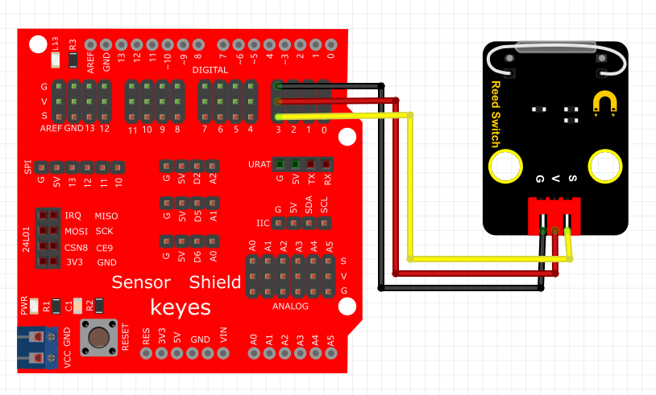

# Arduino


## 1. Arduino简介  

Arduino是一种开源电子平台，其设计旨在为爱好者和专业开发者提供简单、高效的硬件与软件解决方案。自2005年推出以来，Arduino因其易用性和灵活性而受到广泛欢迎，特别是在教育、机器人、物联网（IoT）和原型设计等领域。Arduino平台包含多种型号的开发板（如Arduino UNO、MEGA等），用户可以使用Arduino IDE进行编程，支持C/C++语言。该平台的开放性使得大量的库、示例和文档可供使用，帮助初学者轻松入门。Arduino的核心特点包括：  

- **易用性**：围绕简单的编码和连接方式设计，使得初学者能够快速上手。  
- **兼容性**：能够与多种传感器、模块、和外围设备兼容，从而实现多种应用。  
- **社区支持**：活跃的开发者社区提供丰富的学习资源和项目示例，促进知识的共享和应用的发展。  

## 2. 连接图  

  

## 3. 测试代码  

```cpp  
int ledPin = 13; // 定义数字口13  
int inputPin = 3; // 定义数字口3  

void setup() {  
    pinMode(ledPin, OUTPUT); // 将ledPin设置为输出  
    pinMode(inputPin, INPUT); // 将inputPin设置为输入  
}  

void loop() {  
    int val = digitalRead(inputPin); // 设置数字变量val，读取到数字口3的数值，并赋值给 val  
    if (val == LOW) { // 当val为低电平时，LED亮起  
        digitalWrite(ledPin, HIGH); // LED亮起  
    } else {  
        digitalWrite(ledPin, LOW); // LED变暗  
    }  
}  
```  

## 4. 测试结果  

按照上图接好线，烧录好代码，通电后，当感应到磁铁时，D13灯亮起。  

## 5. 加强训练  

代码：  

```cpp  
int led = 13; // 定义数字口13  
int inputPin = 3; // 定义数字口3  
int x; // 定义变量x  

void setup() {  
    pinMode(led, OUTPUT); // 将led设置为输出  
    pinMode(inputPin, INPUT); // 将inputPin设置为输入  
}  

void loop() {  
    int val = digitalRead(inputPin); // 读取输入口的值  
    if (val == 0) { // 如果值为0  
        x++; // x自增  
        digitalWrite(led, HIGH); // LED灯亮起  
        delay(500); // 延迟0.5秒  
    }  
    if (x == 2) { // 如果x达到2  
        digitalWrite(led, LOW); // LED灯熄灭  
        x = 0; // 重置x  
        delay(500); // 延迟0.5秒  
    }  
}  
```  

结果

上传代码后，感应一次LED灯亮起，再感应一次LED灯熄灭。实现这个功能的关键在于变量x，值得深入思考。


