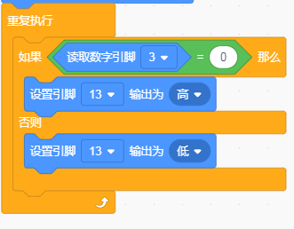

# KidsBlock

## 1. KidsBlock简介  

KidsBlock是一款面向初学者的图形化编程工具，旨在通过可视化界面帮助用户快速学习编程概念。它允许用户通过拖拽模块来构建程序，适合儿童和青少年。KidsBlock支持Arduino等硬件平台，用户可以通过简单的图形化编程实现对各种传感器和模块的控制。该工具提供多种学习项目和教程，增强了学习的趣味性和动手能力，培养学生的逻辑思维及创造力。  

## 2. 连接图  

  

## 3. 测试代码  

1. 在事件栏拖出Arduino启动模块。  

     

2. 在引脚栏拖出两个设置引脚模式模块，一个设置为引脚3输入，另一个设置为引脚13输出。  

     

3. 在控制栏拖出重复执行模块。  

     

4. 在控制栏拖出判断模块，并在判断模块中添加运算的等于模块，等于模块的左边添加读取数字引脚3模块，右边设置为0；当满足条件时，第13引脚输出高电平，否则输出低电平。  

     

## 4. 测试结果  

按照上图接好线，烧录好代码，通电后，当感应到磁铁时，LED模块灯亮起。  

结果

上传代码后，感应一次LED灯亮起，再感应一次LED灯熄灭。实现这个功能的关键在于变量time，值得深入思考。

