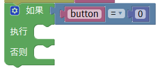

# Mixly

## 1. Mixly简介  

Mixly是一款面向编程初学者的图形化编程工具，它基于Scratch的理念，以简单、直观的方式让用户能够创建程序。Mixly适用于多种硬件平台，尤其是Arduino，使得用户可以通过拖拽模块来实现电子项目的控制和开发。该工具支持丰富的功能模块，包含多种传感器和执行器，适合教育、DIY项目及机器人开发。Mixly提供多种示例和教程，帮助用户轻松入门编程，培养他们的逻辑思维和创造能力。  

## 2. 连接图  

  

## 3. 测试代码  

1. 在变量栏找到声明全局变量模块，将item变量名改为“button”，并设置button初始变量为整数，赋值为0。  

     

2. 初始化设置波特率为9600，表示串口通信的速度。  

     

3. 在变量栏拖出button赋值模块，然后在输入/输出栏拖出数字引脚输入模块，设置引脚为3。  

     

4. 拖出串口栏下的打印并自动换行模块，将之前定义的变量button放在打印模块后面。  

     

5. 在控制栏拖出判断模块，并点击模块上的设置图案增加一个“否则”部分。  

     

6. 在逻辑栏拖出一个等于模块，添加变量button和数字0。  

     

7. 在输入/输出栏拖出设置引脚模块，设置引脚为13为高电平，接着拖出一个延时模块，延时100ms。  

     

8. 再次在输入/输出栏拖出设置引脚模块，设置引脚为13为低电平，最后再拖出延时模块，延时100ms。  

     

## 4. 测试结果  

按照上图正确接线，并烧录好代码，通电后，当感应到磁铁时，D13灯亮起。  

结果

