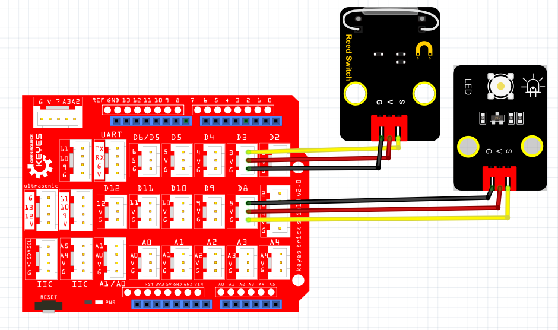

# Python


## 1. Python简介  

Python是一种广受欢迎的高级编程语言，以其简洁易读的语法和强大的功能而著称。由Guido van Rossum于1991年首次发布，Python支持多种编程范式，包括面向对象、函数式和过程式编程。其广泛应用于数据分析、人工智能、网页开发、自动化任务以及嵌入式系统等多个领域。  

Python的设计理念强调代码的可读性和简洁性，使得其成为初学者和专业开发者的理想选择。它拥有丰富的标准库，社区支持极为活跃，用户可以轻松获取大量第三方库和框架，如NumPy、Pandas和Flask等。此外，Python还支持多种平台和操作系统，使得开发具有较高的灵活性和移动性。  

## 2. 连接图  

  

## 3. 测试代码  

```python  
import machine  
import utime  

key = machine.Pin(28, machine.Pin.IN)  # 设置28脚为输入  
led = machine.Pin(25, machine.Pin.OUT)  # 设置25脚为输出  

while True:  
    if key.value() == 0:  # 判断输入是否为高电平  
        led.value(1)  # LED灯亮  
    else:  
        led.value(0)  # LED灯灭  
```  

## 4. 测试结果  

按照上图接好线，烧录好代码；上电后，感应到磁铁后，LED模块灯亮起。  

## 5. 加强训练  

代码：  

```python  
import machine  
import utime  

key = machine.Pin(28, machine.Pin.IN)  
led = machine.Pin(25, machine.Pin.OUT)  
val = 0  

while True:  
    if key.value() == 0:  
        val += 1  
        led.value(1)  
        utime.sleep_ms(300)  
    elif val >= 2:  
        led.value(0)  
        val = 0  
        utime.sleep_ms(300)  
```  

结果

上传代码后，在感应一次时LED灯亮起，再次感应时LED灯熄灭。实现这个功能的关键在于变量val，值得深入思考。


